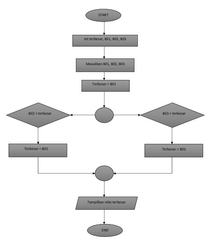
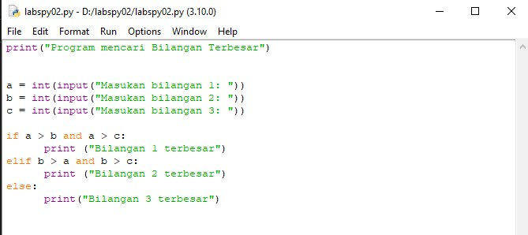
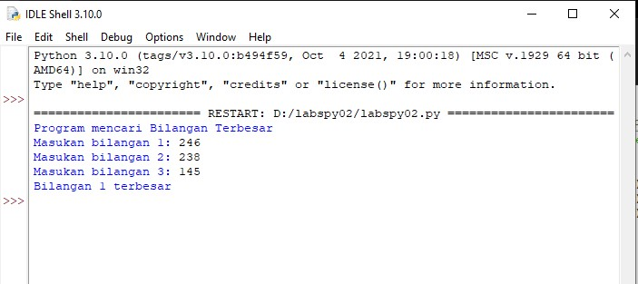
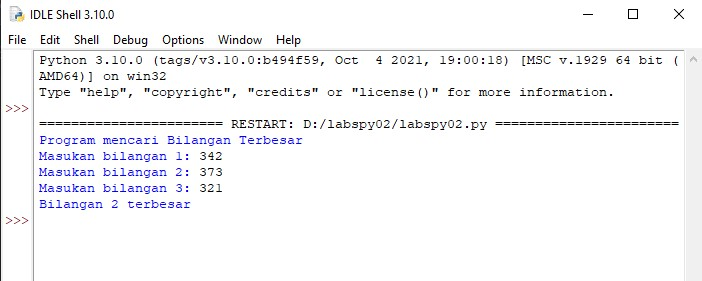
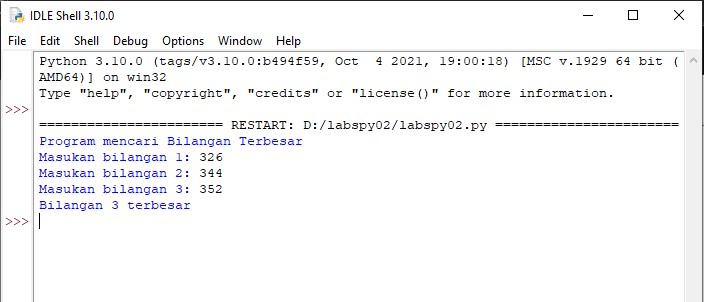

# labspy02
## Tugas Praktikum 2
- Membuat program sederhana dengan input tiga bilangan, dari ketiga bilangan tersebut tampilkan bilangan terbesarnya. 

#### Flowchart


#### Program


```bash
print("Program mencari Bilangan Terbesar")


a = int(input("Masukan bilangan 1: "))
b = int(input("Masukan bilangan 2: "))
c = int(input("Masukan bilangan 3: "))

if a > b and a > c:
      print ("Bilangan 1 terbesar")
elif b > a and b > c:
      print ("Bilangan 2 terbesar")
else:
      print("Bilangan 3 terbesar")
```

#### Output







## Terima kasih